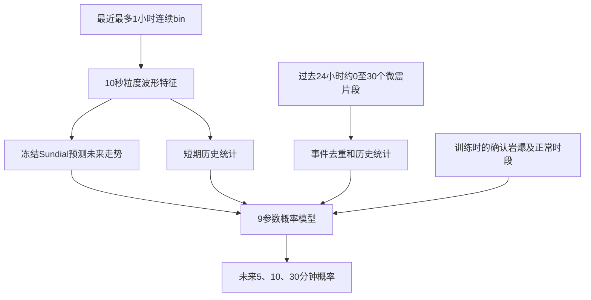

# Sundial 岩爆预测基础版

这是保留的分步高级接口文档。主流程已改为连续bin目录、可选微震bin目录和岩爆时间txt的`run`命令，不需要手填下面的四张CSV，参见[主README](../README.md)。

这个目录实现“最近最多 1 小时连续 DAS + 过去 24 小时已检出的微震片段 → 未来 5/10/30 分钟岩爆概率”。

这是供真实数据到位后开展小样本实验的命令行基础版。**目前没有用真实岩爆数据训练，没有下载或执行 Sundial 权重。** `demo` 只用合成特征和持值预测器验证流程，结果不能解释为现场性能。

原有 `ybjc/ybjc/mic_v3.py` 和 GUI 不做修改。这里另行实现无 GUI、分块处理的数据管线；虽然复用了相同的 int32 波形格式和类似特征名称，**特征公式不与原脚本的规则评分完全相同，不能混用已有 risk_score 作为本模型概率**。

本仓库可以独立运行，不依赖上述原有脚本。

### Sundial 和训练各负责什么

| 部分 | 输入和输出 | 是否训练 |
|---|---|---|
| Sundial 预训练模型 | 历史振动特征 → 未来振动特征的可能走势 | 本基础版冻结已有权重，只推理 |
| 微震历史分支 | 过去24小时的外部检出片段 → 频次、强度、时间统计 | 固定公式，不训练识别器 |
| 岩爆概率模型 | 上述两路信息 → 未来5、10、30分钟岩爆累计概率 | 用确认岩爆和正常监测时段训练9个参数 |

Sundial 不是已经训练好的岩爆分类器。直接下载它的权重能预测数值序列，但还需要训练最后的小模型，才能建立与本站点岩爆标签的关系。只有25次岩爆时先做探索性回测，不能把相邻分钟窗口当成更多独立事件。



### 执行顺序

| 顺序 | 操作 | 是否需要真实数据/权重 |
|---|---|---|
| 1 | 克隆、创建Python环境、运行测试和demo | 都不需要 |
| 2 | 填写4张CSV，运行两次 `extract` | 需要真实数据，不需要权重 |
| 3 | 下载固定版本的Sundial权重 | 需要网络，不需要岩爆标签 |
| 4 | `build` 构造时序样本 | 需要真实数据、标签和Sundial权重 |
| 5 | `train` 拟合小模型并生成时间划分测试报告 | 使用第4步缓存，不重新运行Sundial |
| 6 | `predict` 在一个新时刻预测 | 需要新历史数据和两个模型，不需要未来标签 |

没有真实数据时，完成第1步即可。不要把demo结果作为岩爆性能结论。

## 1. 已包含的内容

- `vendor/Sundial/`：官方仓库Git子模块，固定提交记录在 `UPSTREAM.json`，上游许可证保留；不包含模型权重。
- `rockburst/extract.py`：连续 bin / 外部微震识别结果的特征提取。
- `rockburst/forecast.py`：冻结 Sundial 的本地加载、推理和内容寻址缓存。
- `rockburst/data.py`：两路融合、可用时间检查、未来标签生成。
- `rockburst/model.py`：9 参数的共享系数离散时间风险模型，时间划分和测试报告。
- `templates/`：四张真实数据输入表的空模板。
- `download_model.py`：显式下载指定版本的权重；其他命令不会自动下载。
- `tests/`：读取、时序泄漏、缺失、标签及概率约束测试。

基础版不包含微震识别器训练、Sundial 微调、生产在线文件监听、GUI、独立概率校准。外部微震识别程序负责候选事件、边界与去重，人工确认岩爆表负责监督标签。

## 2. 先验证安装和演示

以下命令使用 Linux/WSL 的 Bash，建议 Python 3.12（本地验证版本为3.12.3）。仓库已公开，可直接克隆：

```bash
git clone --recurse-submodules https://github.com/zhouyllll/sundial-rockburst.git
cd sundial-rockburst
```

如果使用GitHub CLI，可先执行 `gh auth login`、`gh auth setup-git`。如果已经克隆但漏了子模块，在仓库根目录补充：

```bash
git submodule update --init --recursive
```

本机已有工作目录是 `/home/dministrator/linux/yb/sundial_rockburst`，无需再次克隆。所有后续命令都在项目根目录执行。

创建环境、安装基础依赖并运行：

```bash
python3 -m venv .venv
source .venv/bin/activate
python -m pip install --upgrade pip
python -m pip install -r requirements.txt
python -m unittest discover -s tests -v
python -m rockburst demo --output artifacts/demo
```

关闭终端后重新使用项目，先执行 `source .venv/bin/activate`。缺少 `venv` 的 Ubuntu/WSL 环境需先安装对应版本的 `python3-venv` 系统包。

预期：24项测试通过，demo最后输出 `synthetic: true`、`backend: persistence`。可用 `python -m rockburst --help` 或 `python -m rockburst build --help` 查看参数。

演示生成 4 天**合成特征**、12 次合成岩爆，使用 `persistence`（维持最后观测值）完成建样本、训练、验证和测试。原始 bin 的读取另由测试中的合成波形验证。

演示输出：

```text
artifacts/demo/
  continuous.csv             合成连续特征
  events.csv                 合成微震特征
  coverage.csv               合成覆盖区间
  rockbursts.csv              合成确认岩爆
  dataset.npz
  dataset.npz.report.json     样本数量及被跳过原因
  SYNTHETIC_DEMO_ONLY.json    合成数据与基线的明确标记
  run/model.json
  run/metrics.json
  run/train_predictions.csv
  run/validation_predictions.csv
  run/test_predictions.csv
```

可对合成数据做单次预测：

```bash
python3 -m rockburst predict \
  --continuous artifacts/demo/continuous.csv \
  --events artifacts/demo/events.csv \
  --coverage artifacts/demo/coverage.csv \
  --zone demo \
  --model artifacts/demo/run/model.json \
  --backend persistence \
  --at 2026-01-04T06:00:00+00:00 \
  --output artifacts/demo/prediction.json
```

`persistence` 只是测试/对照基线，不会伪装成 Sundial。Sundial 缺权重、缺依赖或报错时不会静默回退。

## 3. 时间和数据定义

每次预测时刻为 `t`：

```text
连续输入： [t-60分钟, t] 内已经可用的完整10秒特征块
微震输入： [t-24小时, t] 内发生、结束且已检出可用的微震事件
预测目标： (t,t+5分钟]、(t,t+10分钟]、(t,t+30分钟] 内至少一次确认岩爆
```

连续输入可固定为 30 或 60 分钟。默认容忍文件落盘导致最多 60 秒尾部延迟；此时只用历史区间内实际可用的块，**不会为了凑满长度向前额外读取**。默认的实际长度约 59～60 分钟，推理输出明确报告截止时刻和延迟；要求零延迟可设置 `--max-lag-seconds 0`。模型预测从连续数据截止时刻开始，自动跳过已经经过的预测步，再对应实际的未来区间。

如果岩爆发生于 12:00，在 11:30 做预测，1 小时连续输入是 10:30～11:30。这仍然只输入一小时，但事件归档若要提供所有提前时刻的一小时历史，需保存到岩爆前 90 分钟。不能拿 11:00～12:00 的数据宣称实现 11:30 的预警。

所有时间必须有时区，例如 `2026-06-01T12:00:00+08:00`。内部统一 UTC；不使用电脑默认时区。`available_time` 是整个文件完成采集、传输和必要处理后可用的时刻。不要把文件起始时间当可用时间。

## 4. 准备四张 CSV

复制 `templates/` 内表头到自己的数据目录。下面的行仅解释格式，不是已有真实标注。

首次准备时执行以下命令。`cp -n` 避免覆盖已经填写的表：

```bash
mkdir -p data/raw artifacts
cp -n templates/continuous_manifest.csv data/continuous_manifest.csv
cp -n templates/microseismic_manifest.csv data/microseismic_manifest.csv
cp -n templates/coverage.csv data/coverage.csv
cp -n templates/rockbursts.csv data/rockbursts.csv
```

目录可以是：

```text
data/
  continuous_manifest.csv
  microseismic_manifest.csv
  coverage.csv
  rockbursts.csv
  raw/
    continuous_001.bin
    micro_001.bin
```

也可以将大体积bin保存在其他磁盘，在清单中填写绝对路径。CSV用UTF-8保存；字段名必须与模板完全一致。路径含逗号时使用标准CSV引号。

### 4.1 连续文件清单 continuous_manifest.csv

```csv
file_path,zone_id,start_time,available_time,fs,channels
raw/continuous_001.bin,zone_A,2026-06-01T10:00:00+08:00,2026-06-01T10:00:32+08:00,5000,42
```

- 相对路径相对于这张 CSV 的目录。
- 格式为**无文件头、小端 int32、采样点×通道交错**，与已检查的 bin 读取方式一致。
- 根据文件大小和显式填写的采样率/通道数计算结束时间；不猜通道数、不静默截断损坏文件。
- 清单可覆盖多天，程序按实际预测时刻只使用最近一小时；不会将不连续片段强行拼接。
- 同一区域的文件不能重叠；跨相邻文件的 UTC 10 秒块可正确拼接。
- 至少包括正常时段；只有岩爆前窗口不能估计日常概率与误报。

### 4.2 微震文件清单 microseismic_manifest.csv

```csv
file_path,zone_id,start_time,available_time,fs,channels,event_id,event_start_time,event_end_time
raw/micro_001.bin,zone_A,2026-06-01T09:10:00+08:00,2026-06-01T09:10:33+08:00,5000,42,ms_001,2026-06-01T09:10:12+08:00,2026-06-01T09:10:13+08:00
```

- 这是**外部程序检出的微震**，不是人工确认岩爆。
- 明确标出片段中实际事件的起止时间，能量代理量只在事件区间计算。
- 一个 bin 多个事件：写多行，使用不同 `event_id` 和边界。
- 同一事件重复检出/跨多个 bin：外部先去重并准备含完整事件的片段；程序拒绝重复 ID，不自动猜测是否同一事件。
- 如果只知道30秒片段、没有事件边界，可暂以整个片段作为区间，但这时输入是“片段数量/片段能量”，不应解释为准确的事件数/事件能量；训练与预测必须采用相同定义。
- 过去24小时通常0～30个事件，基础版无需填充到30，也不硬截断超过30的记录。
- 零事件可使用只有表头的清单。
- 各时段外部识别器的版本和阈值应一致，并在自己的实验记录中保存；基础版不会从 bin 自动恢复识别器设置。

### 4.3 覆盖记录 coverage.csv

```csv
zone_id,start_time,end_time,event_archive_complete,rockburst_record_complete
zone_A,2026-06-01T00:00:00+08:00,2026-06-10T00:00:00+08:00,1,1
```

- `event_archive_complete=1`：该区间设备/识别器正常，微震检出结果完整归档。
- `rockburst_record_complete=1`：该区间确认岩爆记录完整，可建立未来标签。
- 每个区域记录必须互不重叠；停机/缺失拆成独立区间，标记为0。
- 没有微震文件只有在历史24小时归档完整时才解释为零检出；停机不会填零。
- 建训练样本还要求未来30分钟的岩爆记录完整。末尾未来未知的时刻不会标为负例。
- 预测仅使用微震历史覆盖标记，不要求未来标签记录。

### 4.4 确认岩爆表 rockbursts.csv

```csv
event_id,zone_id,onset_time,end_time,group_id
rb_001,zone_A,2026-06-05T12:00:00+08:00,2026-06-05T12:00:03+08:00,cluster_001
```

只有人工/独立记录确认的25次真实岩爆放在这里。紧密关联的岩爆群使用相同 `group_id`，程序阻止同一群的正样本跨训练/验证/测试。瞬时事件可令结束时间等于开始时间。发生中的岩爆时刻不用于提前预测训练。

## 5. 提取真实特征

假设以上四张表已放入 `data/`，通道15～34确实对应同一物理监测区域：

```bash
python3 -m rockburst extract continuous \
  --manifest data/continuous_manifest.csv \
  --monitor 15-34 \
  --output artifacts/continuous.csv

python3 -m rockburst extract events \
  --manifest data/microseismic_manifest.csv \
  --monitor 15-34 \
  --output artifacts/events.csv
```

默认50～500Hz、四阶带通；采样率必须大于1000Hz。通道参数为1起始。滤波只在已结束的块/事件片段内进行，结果可用时间不早于源文件可用时间。

连续特征包括均方值、RMS、峰值、能量代理、STA/LTA、相邻通道绝对相关系数、相对最强通道的活跃比例、低频带比例。能量代理未标定为焦耳。

同一区域目前要求一致的采样率、通道数、选择通道和滤波配置。41/42通道混合或传感器位置变化需先按物理配置分组，分别建样本/模型；基础版不会自动推断通道映射。一次模型训练针对一个 `zone_id`。

## 6. 准备 Sundial（有数据后再执行）

官方 GitHub 仓库是示例与说明，权重和模型代码在 Hugging Face。先安装适合本机 CPU/CUDA 的 PyTorch，再安装：

```bash
python -m pip install -r requirements-sundial.txt
```

适配器按上游 Quickstart 固定 `transformers==4.40.1`，使用 FP32。当前环境仅验证了 NumPy/SciPy 路径；**尚未实测本机的 PyTorch/Sundial 推理**。

安装后检查环境和显卡：

```bash
python -c "import torch, transformers; print('torch:', torch.__version__); print('transformers:', transformers.__version__); print('CUDA available:', torch.cuda.is_available())"
```

CPU用户后续统一使用 `--device cpu`；GPU用户应确认输出 `CUDA available: True`，后续统一使用 `--device cuda`。PyTorch安装命令按 [官方安装选择器](https://pytorch.org/get-started/locally/) 中的系统、包管理器与CUDA选项选择，不盲目复用其他机器的CUDA安装命令。

在 [模型仓库提交历史](https://huggingface.co/thuml/sundial-base-128m/commits/main) 选择一个完整40位SHA，再执行（替换占位文本）：

```bash
python download_model.py \
  --revision 模型仓库的完整40位提交SHA \
  --output models/sundial-base-128m
```

这一步会联网下载。GitHub 示例仓库的提交SHA不能用于这个参数。运行时通过 `trust_remote_code=True` 加载所下载的模型代码，务必使用指定的官方模型来源。

如果不想手动复制SHA，可在联网环境下执行以下完整命令：先查询当前模型提交，再将这个固定SHA交给下载器。终端输出的SHA需要保存到自己的实验记录中。

```bash
python - <<'PY'
import subprocess
import sys
from huggingface_hub import HfApi

revision = HfApi().model_info("thuml/sundial-base-128m").sha
print("本次固定的模型提交:", revision, flush=True)
subprocess.run([
    sys.executable, "download_model.py", "--revision", revision,
    "--output", "models/sundial-base-128m",
], check=True)
PY
```

下载完成后可以先做一次**合成数值序列上的真实Sundial推理**，检查权重和依赖能否运行。下面固定使用CPU；验证GPU时将 `device="cpu"` 改成 `device="cuda"`。

```bash
python - <<'PY'
import numpy as np
from rockburst.forecast import Forecaster

model = Forecaster(
    backend="sundial", model_path="models/sundial-base-128m",
    device="cpu", samples=20,
)
x = np.log1p(10 + 2 * np.sin(np.arange(360) / 20))
result = model.predict(x, horizon=180)
assert result.shape == (20, 180)
assert np.isfinite(result).all()
print("Sundial推理成功，输出形状:", result.shape)
PY
```

这个检查不训练岩爆模型，也不代表岩爆预测效果。保存依赖快照便于之后复现：

```bash
mkdir -p artifacts
python -m pip freeze > artifacts/environment.txt
```

模型适配器：

- 只加载本地目录；缺权重直接报错。
- `eval()`、`requires_grad_(False)`、`inference_mode()`，不训练Sundial。
- 输入是连续分支的 `log1p(mean_square)`，最多360点；默认生成20条未来样本。
- 微震分支直接用稀疏事件统计，不再单独调用Sundial。
- 缓存键包含输入、权重/代码内容哈希、预测长度、样本数与运行环境。
- 同一输入采用固定派生随机种子；相同训练/预测配置必须一致。跨CPU/GPU不保证位级一致，基础版会拒绝配置不匹配。

## 7. 建立训练数据集

下面时间仅为示例，必须改成自己的真实覆盖区间；`start/end`需对齐整分钟，`end`不包含。

```bash
python3 -m rockburst build \
  --continuous artifacts/continuous.csv \
  --events artifacts/events.csv \
  --coverage data/coverage.csv \
  --rockbursts data/rockbursts.csv \
  --zone zone_A \
  --start 2026-06-02T00:00:00+08:00 \
  --end 2026-07-01T00:00:00+08:00 \
  --history-minutes 60 \
  --backend sundial \
  --model-path models/sundial-base-128m \
  --device cuda \
  --samples 20 \
  --cache cache/sundial \
  --output artifacts/dataset.npz
```

CPU运行使用 `--device cpu`。无需权重的流程检查使用 `--backend persistence`，去掉模型路径即可；它产生的模型不能冒充Sundial模型。

每分钟一个预测时刻。每个样本的融合特征形状 `[3,6]`，三个条件区间分别为 `(0,5]`、`(5,10]`、`(10,30]` 分钟：

1. 最近5分钟均方值与此前窗口均方值的 `log1p` 差。
2. 最近5分钟平均空间相干性。
3. `log1p(最近6小时微震数)`。
4. `log1p(过去24小时微震能量代理量之和)`。
5. `log1p(距最近微震的分钟数)`，无事件取1440。
6. 相应未来区间预测的平均对数均方值相对于最近5分钟水平的变化；先每条预测路径求均值，再跨路径取中位数。

前五项在三个区间中共享，第六项随预测区间变化。首版的统计定义固定，不做自动大规模特征搜索。

标签：

| 下一次岩爆 | 区间1 | 区间2 | 区间3 |
|---|---|---|---|
| 3分钟后 | 1 | 不计损失 | 不计损失 |
| 8分钟后 | 0 | 1 | 不计损失 |
| 18分钟后 | 0 | 0 | 1 |
| 未来30分钟无岩爆 | 0 | 0 | 0 |

报告会列出缺连续数据、缺24小时归档覆盖、缺未来标签、岩爆发生中等跳过原因。大量跳过时先处理数据，不用放宽检查来凑样本。

## 8. 训练和测试

```bash
python3 -m rockburst train \
  --dataset artifacts/dataset.npz \
  --train-end 2026-06-18T00:00:00+08:00 \
  --validation-end 2026-06-24T00:00:00+08:00 \
  --ridge 0.1 1 10 \
  --threshold 0.5 \
  --output artifacts/run_01
```

必须根据真实25次事件分布选日期。每个训练区间都要有正例、负例，验证集也必须有岩爆。第一次查看最终测试前固定方案，之后不要反复用同一测试集调参。

- 训练：`t+30分钟 <= train_end`。
- 验证：`t >= train_end` 且 `t+30分钟 <= validation_end`。
- 测试：`t >= validation_end`，未来标签仍需完整。
- 每个边界前30分钟可能跨界的标签被剔除。
- 输入历史可包含此前已经观测的时段，这是模拟真实部署的时间回放，不是严格完全不重叠的历史窗口划分。
- 同一 `group_id` 不得出现在多个集合的正样本中；应将整个事件群放在同一时间段。
- 标准化只在训练集拟合；只用验证集平均Brier分数选择L2正则强度。
- 测试不参与训练或选参；选定模型后不再合并验证集重训。
- 首版不做负例下采样、类别加权或概率校准；输出明确标为实验性、未独立校准。

小模型公式为 `q_j = sigmoid(alpha_j + beta·z_j)`，3个截距+6个共享系数，优化有效区间的交叉熵加L2正则。输出：

```text
P5  = q1
P10 = 1 - (1-q1)(1-q2)
P30 = 1 - (1-q1)(1-q2)(1-q3)
```

因此自动满足 `0 <= P5 <= P10 <= P30 <= 1`。

`metrics.json` 包含每个时窗的 Brier、log loss、Average Precision（不是梯形PR-AUC）、报警时间比例、报警次数、事件召回等。没有正例时AP和事件召回输出null。

报警按跨越固定阈值触发，连续超阈值分钟合并为一次；输入缺失会中断连续报警段。命中要求**报警开始时刻**之后相应时窗内发生下一次岩爆，不把很早开始且长期不解除的报警算成所有后续岩爆的成功预警。误报频次按每24小时**实际可评估时间**归一化，不能称为包含缺失时段的全天现场误报率。只统计存在可评估预警时刻的事件，需结合建样本报告核对被排除的事件和时间。

只有25次事件，窗口数量不能代替独立事件数；目前未实现事件群bootstrap置信区间和独立校准。0.5只是演示阈值，不是推荐的现场报警阈值。

## 9. 用训练好的模型做一次预测

```bash
python3 -m rockburst predict \
  --continuous artifacts/continuous.csv \
  --events artifacts/events.csv \
  --coverage data/coverage.csv \
  --zone zone_A \
  --model artifacts/run_01/model.json \
  --backend sundial \
  --model-path models/sundial-base-128m \
  --device cuda \
  --samples 20 \
  --cache cache/sundial \
  --at 2026-06-25T12:00:00+08:00 \
  --output artifacts/prediction.json
```

需要与训练使用相同模型权重、环境、设备、采样数、预处理及区域。输入不足时输出 `status=insufficient_data`，三个概率为 `null`，退出码2；不会输出假的低风险。其他配置/文件错误退出码1。正常退出码0。

预测时不需要读取真实岩爆标签。确认岩爆表只用于建训练标签和回测。

## 10. 机器配置与数据量

按5000Hz、42通道、int32：一小时连续约3.02GB，30个30秒片段约0.76GB；扣除重叠之前最多约3.78GB原始输入。它们分块在CPU上提取特征，不整体搬进显存。

- 起步：8核CPU、32GB内存、已有8GB显存GPU小批量验证；CPU也可运行。
- 更方便批处理：12～16核CPU、64GB内存、12～16GB显存GPU。
- 工作盘1TB SSD可起步；正常监测数据和长期归档另计，全天连续约72.6GB。
- 不需要多卡；9参数模型训练本身用CPU。

以上是估算，尚无本机Sundial吞吐实测。当前提取命令离线按manifest运行，推理缓存避免重复计算；自动追加文件监听和增量特征索引是后续工作。

建议真实数据到位后先跑“历史连续特征基线 / 加微震历史 / 再加Sundial”的对照实验。目前提供的是完整融合版本和持值预测对照，自动特征消融实验尚未实现。

## 11. 结果文件怎么看

| 文件/字段 | 含义 |
|---|---|
| `dataset.npz.report.json` | 有效样本、独立事件/事件群数、跳过原因和预处理配置 |
| `run_01/model.json` | 小概率模型参数、标准化参数、权重指纹、输入长度和实验配置 |
| `run_01/metrics.json` | 训练/验证/测试各自指标、固定阈值、剔除数量 |
| `run_01/test_predictions.csv` | 测试时刻的三个预测概率、真实累计标签、对应岩爆ID |
| `prediction.json` 的 `p_5min` | 从预测时刻起未来5分钟内至少一次确认岩爆的实验性概率 |
| `p_10min`、`p_30min` | 分别为未来10、30分钟内的累计概率，不是第10/30分钟的瞬时概率 |
| `quality.continuous_cutoff` | 这次实际使用的连续数据截止时刻 |
| `quality.continuous_lag_seconds` | 数据截止时刻距预测时刻的延迟 |
| `quality.microseismic_count_24h` | 实际纳入的过去24小时微震数量 |
| `calibration` | 当前为 `not_independently_calibrated`，不能当作已验证的现场概率 |

先看样本覆盖，再看独立事件数，最后看召回、误报和概率指标。只保留少量容易预测的分钟可能得到好看的分数，但不代表整段监测有效。完整的本地验证记录见 [VALIDATION.md](../VALIDATION.md)。

## 12. 常见问题

| 提示或现象 | 排查方式 |
|---|---|
| `No module named rockburst` | 回到包含 `rockburst/` 的仓库根目录，再执行 `python -m rockburst` |
| `No module named scipy/numpy` | 激活 `.venv`，用同一个 `python -m pip install -r requirements.txt` 安装 |
| 时间必须带时区 | 将时间改成 `2026-06-01T12:00:00+08:00` 或UTC的 `...Z` |
| bin大小不能整除 | 核实有无文件头、是否int32、实际通道数、文件是否写完；不要直接丢尾部字节 |
| 采集/通道/滤波配置不一致 | 41/42通道及不同物理配置先分组，连续与微震提取参数保持一致 |
| `available_time` 早于采集结束 | 填写完整文件真正可用时刻，而非文件名里的起始时刻 |
| 连续文件重叠 | 检查清单中重复文件和设备时间，不要用覆盖相同时间的两份波形叠加计数 |
| `event_history_incomplete` | 检查前24小时识别器和归档是否完整；有停机就保留缺失，不人为填1 |
| `continuous_history_incomplete` | 检查前30/60分钟是否连续，是否存在中间缺块或文件尚未可用 |
| `continuous_too_old_or_unavailable` | 最新完整块超过允许延迟；确认文件落盘/识别时间和预测时刻 |
| `future_labels_incomplete` | 该时刻后30分钟没有完整确认岩爆记录；不能把未知标成无岩爆 |
| 数据集没有有效样本 | 检查start/end、zone、24小时覆盖、连续历史和未来标签的共同可用区间 |
| 训练区间缺少正例或负例 | 检查真实事件和正常时段；调整开发集边界，不能复制事件制造独立样本 |
| 同一岩爆群跨集合 | 移动时间划分边界，将整个事件群留在同一集合 |
| 本地模型目录没有权重 | GitHub子模块不是模型权重，先执行第6节的Hugging Face下载步骤 |
| Transformers版本不匹配 | 使用 `transformers==4.40.1`；不要在同一实验中随意升级 |
| CUDA不可用或显存不足 | 检查PyTorch构建和驱动；可在CPU上重新build/train/predict，切换设备后不要混用旧配置 |
| 预测器与训练时不同 | 保持backend、权重内容、设备、版本和samples一致；改变后重新build和train |
| 概率接近常数 | 检查事件稀少、特征无变化、正则强度和输入质量；不代表程序一定出错 |

`predict` 退出码2表示输入不足，JSON中概率为null；不要将null转换成0。其他配置/输入错误退出码1，成功为0。

## 13. 后续更新与文件管理

原始bin、真实CSV、权重、缓存和输出保存在 `data/`、`models/`、`cache/`、`artifacts/`，已被 `.gitignore` 排除。这里只上传源码、空模板、说明和固定版本的上游子模块，不上传真实监测数据。不要把凭据写入命令示例或源码。

在另一台电脑更新仓库：

```bash
git pull --ff-only
git submodule update --init --recursive
source .venv/bin/activate
python -m pip install -r requirements.txt
python -m unittest discover -s tests -v
```

有Sundial环境时另按 `requirements-sundial.txt` 更新；保留每次实验的依赖快照、模型版本、原始CSV和输出目录。更新权重、通道配置、识别器或特征定义后，应重新构造训练数据并回测，不能直接复用旧概率模型。

官方来源：

- [Sundial 官方 GitHub](https://github.com/thuml/Sundial)
- [预训练权重和模型代码](https://huggingface.co/thuml/sundial-base-128m)
- [本项目固定的上游提交](../UPSTREAM.json)

Sundial官方代码与模型采用其上游许可证；子模块中的许可证随上游保留。本仓库不把基础版实验结果表述为已经验证的岩爆预警系统。
